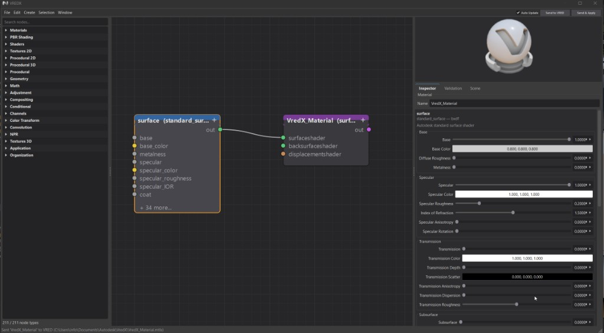

# VredX — MaterialX Authoring for VRED

A VRED script plugin that adds a node-graph editor for **authoring, editing, and
applying MaterialX materials** inside Autodesk VRED Pro.



## Features

- **Palette from your VRED install** — nodedef libraries are read from the same
  `VREDPro-*` version that hosts the plugin (no cross-version conflicts)
- **Node canvas** — typed ports, bezier wires, magnetic pin snapping, undo/redo
- **VRED bridge** — Send to VRED, Send & Apply, optional Auto Update, preview swatch
- **Validation** — type/cycle checks and VRED-specific warnings before send

## Requirements

- Autodesk VRED Pro with MaterialX support (2024+; tested on 2027 / VREDPro-19.1)
- Runtime: VRED's bundled Python + PySide6 (no extra packages)

## Install

Copy this repository into your VRED Scripts folder (elevated prompt if VRED is
under Program Files):

```
C:\Program Files\Autodesk\VREDPro-19.1\lib\plugins\WIN64\Scripts\VredX
```

Before starting VRED, package the library so the plugin scanner only sees one
loose Python file:

1. Zip the `vredx/` folder to `vredx.zip` (paths inside the zip must start with
   `vredx/`).
2. Delete the loose `vredx/` folder from the installed copy.

Restart VRED, then open **VREDX** from the menu bar or Scripts panel.

**Do not leave loose `.py` files under `vredx/`.** VRED's plugin scanner executes
every loose `.py` file it finds. The zip keeps the library importable via
`sys.path` without being scanned.

### What gets installed

```
VredX/
  VredX.py          ← only loose Python entry point VRED executes at startup
  vredx.zip         ← entire editor library (imported, not scanned)
  presets/          ← starter materials
  examples/         ← sample graphs
  resources/        ← icons
  README.md
  LICENSE
```

## How it runs in VRED

1. VRED scans `…/Scripts/` and executes **one** loose file: `VredX/VredX.py`.
2. That entry point adds `vredx.zip` to `sys.path` and imports the `vredx` package.
3. `VredXPlugin` creates the dockable UI and registers the **VREDX** menu.
4. MaterialX nodedefs are loaded from
   `<VREDPro>/runtimeData/MaterialX/libraries` (the hosting install only).

Without the zip packaging, dozens of loose `.py` files under `vredx/` would each
be executed by VRED at startup — slow, noisy, and broken for relative imports.

## Repository contents

This repo ships **plugin source + README**. It does **not** include:

| Excluded | Reason |
|----------|--------|
| `docs/` | Developer reference (e.g. support matrix); not installed with the plugin |
| `tests/` | Dev/CI only (keep locally or in a separate CI repo) |
| `.pytest_cache/` | Local test cache |
| `resources/libraries/` | Large MaterialX snapshot; runtime uses VRED's live libraries |

## License

MIT — see [LICENSE](LICENSE).
